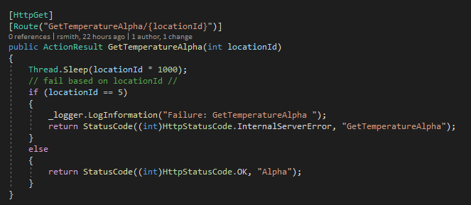

# Round Robin with Multiple Endpoints
### Goals: 
- Set up a way to gracefully and quickly fail on endpoints that need to be load balanced, but have not been set up yet.
- Further, keep using an endpoint for subsequent calls.
- If an endpoint is down or doesn't respond within a time frame, move on to the next one.
- If all endpoints, fail, tell the calling API to use the data it has.
----

## Weather API 
Weather API is the source of the API calls.  

For this test, there are three instances.  The only parameter is a locationId, which is used to make the end points break or slow down.
Each returns its name – Alpha | Beta | Gamma.
The name is returned prov


- Alpha is programmed to be slow – it has a thread sleep command that makes it sleep for locationId * 1000 ms.  Also, if the locationId is **5** – it breaks.



- Beta breaks if the locationId is **10**.

- Gamma breaks if the locationId is **15**.


 ---

 ### Weather Service

 #### Startup
 Add the required features to make this work.

 - Add logging
 ```CSharp
  Log.Logger = new LoggerConfiguration()
                   .ReadFrom.Configuration(configuration)
                   .CreateLogger();
 ```

 - Add cache
 ```CSharp
    services.AddDistributedMemoryCache();
 ```

 - Add Polly Timeout Policy
 [Link](https://github.com/App-vNext/Polly/wiki/Polly-and-HttpClientFactory)
  ```CSharp
            var timeoutPolicySeconds3 = Policy.TimeoutAsync<HttpResponseMessage>(3);
 ```

 - Add [inject] the three end points
 ```CSharp
 services.AddHttpClient("TemperatureServiceAlpha", client =>
            {
                client.BaseAddress = new Uri("http://localhost:6001/"); // TODO: actual paths  //
                client.DefaultRequestHeaders.Add("Accept", "application/json");
            }).AddPolicyHandler(timeoutPolicySeconds3); 

            services.AddHttpClient("TemperatureServiceBeta", client =>
            {
                client.BaseAddress = new Uri("http://localhost:6001/");
                client.DefaultRequestHeaders.Add("Accept", "application/json");
            }).AddPolicyHandler(timeoutPolicySeconds3); 

            services.AddHttpClient("TemperatureServiceGamma", client =>
            {
                client.BaseAddress = new Uri("http://localhost:6001/");
                client.DefaultRequestHeaders.Add("Accept", "application/json");
            }).AddPolicyHandler(timeoutPolicySeconds3);
 ```

> The HttpClient also has a timeout property which worked as well.


#### Controller 


